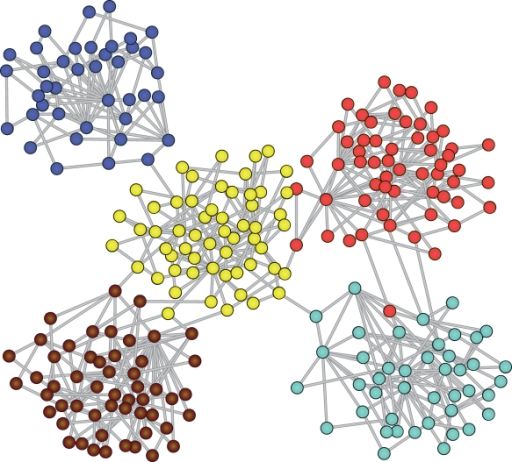

# Awesome Community Detection Research Papers

   

A collection of community detection papers with implementations.

Similar collections about [graph classification](https://github.com/benedekrozemberczki/awesome-graph-classification), [classification/regression tree](https://github.com/benedekrozemberczki/awesome-decision-tree-papers), [fraud detection](https://github.com/benedekrozemberczki/awesome-fraud-detection-papers), and [gradient boosting](https://github.com/benedekrozemberczki/awesome-gradient-boosting-papers) papers with implementations.

  

##### Table of Contents  

1. [Factorization](#factorization)  
2. [Deep Learning](#deep-learning) 
3. [Label Propagation, Percolation and Random Walks](#label-propagation-percolation-and-random-walks) 
4. [Tensor Decomposition](#tensor-decomposition)
5. [Spectral Methods](#spectral-methods) 
6. [Temporal Methods](#temporal-methods) 
7. [Cyclic Patterns](#cyclic-patterns)
8. [Centrality and Cuts](#centrality-and-cuts) 
9. [Physics Inspired](#physics-inspired) 
10. [Others](#others) 

## Factorization

- **Graph Embedding with Self-Clustering (ASONAM 2019)**
  - Benedek Rozemberczki, Ryan Davies, Rik Sarkar, and Charles Sutton
  - [[Paper]](https://arxiv.org/abs/1802.03997)
  - [[Python Reference]](https://github.com/benedekrozemberczki/GEMSEC)

- **GMC: Graph-based Multi-view Clustering (TKDE 2019)**
  - Hao Wang, Yan Yang, Bing Liu
  - [[Paper]](https://www.researchgate.net/publication/331602096_GMC_Graph-based_Multi-view_Clustering)
  - [[Matlab Reference]](https://github.com/cshaowang/gmc)

- **Knowledge Graph Enhanced Community Detection and Characterization (WSDM 2019)**
  - Shreyansh Bhatt, Swati Padhee, Amit Sheth, Keke Chen ,Valerie Shalin, Derek Doran, and Brandon Minnery 
  - [[Paper]](https://dl.acm.org/authorize.cfm?key=N676882)
  - [[Java Reference]](https://github.com/shreyanshbhatt/KnowledgeGraph_in_CommunityDetection)
  
- **Non-Linear Attributed Graph Clustering by Symmetric NMF with PU Learning (Arxiv 2018)**
  - Seiji Maekawa, Koh Takeuch, Makoto Onizuka
  - [[Paper]](https://arxiv.org/abs/1810.00946)
  - [[Python Reference]](https://github.com/seijimaekawa/NAGC)
  
- **Deep Autoencoder-like Nonnegative Matrix Factorization for Community Detection (CIKM 2018)**
  - Fanghua Ye, Chuan Chen, and Zibin Zheng
  - [[Paper]](https://smartyfh.com/Documents/18DANMF.pdf)
  - [[Python Reference]](https://github.com/benedekrozemberczki/DANMF)
  - [[Matlab Reference]](https://github.com/smartyfh/DANMF)

- **Adaptive Community Detection Incorporating Topology and Content in Social Networks (Knowledge-Based Systems 2018)**
  - Qin Meng, Jin Di, Lei Kai, Bogdan Gabrys, Katarzyna, Musial-Gabrys
  - [[Paper]](https://www.sciencedirect.com/science/article/pii/S0950705118303885?dgcid=coauthor)
  - [[Matlab Reference]](https://github.com/KuroginQin/ASCD)

- **Learning Latent Factors for Community Identification and Summarization (IEEE Access 2018)**
  - Tiantian He, Lun Hu, Keith C. C. Chan, and Pengwei Hu 
  - [[Paper]](https://ieeexplore.ieee.org/document/8374421)
  - [[Executable Reference]](https://github.com/he-tiantian/LFCIS)
  
- **Bayesian Robust Attributed Graph Clustering: Joint Learning of Partial Anomalies and Group Structure (AAAI 2018)**
  - Aleksandar Bojchevski and Stephan Günnemann
  - [[Paper]](https://www.aaai.org/ocs/index.php/AAAI/AAAI18/paper/viewFile/16363/16542)
  - [[Python Reference]](https://github.com/abojchevski/paican)
  
- **A Poisson Gamma Probabilistic Model for Latent Node-group Memberships in Dynamic Networks (AAAI 2018)**
  - Sikun Yang and Heinz Koeppl
  - [[Paper]](https://arxiv.org/pdf/1805.11054.pdf)
  - [[C Reference]](https://github.com/stephenyang/dynamic-Edge-Partition-Models)
  
- **Sentiment-driven Community Profiling and Detection on Social Media (ACM HSM 2018)**
  - Amin Salehi, Mert Ozer, and Hasan Davulcu
  - [[Paper]](https://arxiv.org/pdf/1810.06917v1.pdf)
  - [[Matlab Reference]](https://github.com/amin-salehi/GSNMF)
  
- **TNE: A Latent Model for Representation Learning on Networks (Arxiv 2018)**
  - Abdulkadir Çelikkanat and Fragkiskos D. Malliaros 
  - [[Paper]](https://arxiv.org/pdf/1611.06645.pdf)
  - [[Python Reference]](https://github.com/abdcelikkanat/TNE)
  
- **Non-Linear Attributed Graph Clustering by Symmetric NMF with PU Learning (Arxiv 2018)**
  - Seiji Maekawa, Koh Takeuch, Makoto Onizuka
  - [[Paper]](https://arxiv.org/abs/1810.00946)
  - [[Python Reference]](https://github.com/seijimaekawa/NAGC)
  
- **Community Preserving Network Embedding (AAAI 17)**
  - Xiao Wang, Peng Cui, Jing Wang, Jain Pei, WenWu Zhu, Shiqiang Yang
  - [[Paper]](https://aaai.org/ocs/index.php/AAAI/AAAI17/paper/view/14589/13763)
  - [[Python Reference]](https://github.com/benedekrozemberczki/M-NMF)
  - [[Matlab Reference]](https://github.com/AnryYang/M-NMF)
  
- **Self-weighted Multiview Clustering with Multiple Graphs (IJCAI 17)**
  - Feiping Nie, Jing Li, and Xuelong Li
  - [[Paper]](https://www.ijcai.org/proceedings/2017/0357.pdf)
  - [[Matlab Reference]](https://github.com/kylejingli/SwMC-IJCAI17)
  
- **Semi-supervised Clustering in Attributed Heterogeneous Information Networks (WWW 17)**
  - Xiang Li, Yao Wu, Martin Ester, Ben Kao, Xin Wang, and Yudian Zheng
  - [[Paper]](https://dl.acm.org/citation.cfm?id=3052576)
  - [[Python Reference]](https://github.com/wedoso/SCHAIN-NL)
  
- **Learning Community Embedding with Community Detection and Node Embedding on Graph (CIKM 2017)**
  - Sandro Cavallari, Vincent W. Zheng, Hongyun Cai, Kevin Chen-Chuan Chang, and Erik Cambria
  - [[Paper]](http://sentic.net/community-embedding.pdf)
  - [[Python Reference]](https://github.com/andompesta/ComE)
  
- **Cross-Validation Estimate of the Number of Clusters in a Network (Scientific Report 2017)**
  - Matsuro Kawamoto and Yoshiyuki Kabashima
  - [[Paper]](https://arxiv.org/abs/1605.07915)
  - [[Julia Reference]](https://github.com/tatsuro-kawamoto/graphBIX)
  
- **Comparative Analysis on the Selection of Number of Clusters in Community Detection (ArXiv 2017)**
  - Matsuro Kawamoto and Yoshiyuki Kabashima
  - [[Paper]](https://arxiv.org/abs/1606.07668)
  - [[Julia Reference]](https://github.com/tatsuro-kawamoto/graphBIX)
  
- **Subspace Based Network Community Detection Using Sparse Linear Coding (TKDE 2016)**
  - Arif Mahmood and Michael Small 
  - [[Paper]](https://ieeexplore.ieee.org/document/7312985)
  - [[Python Reference]](https://github.com/DamonLiuTHU/Subspace-Based-Network-Community-Detection-Using-Sparse-Linear-Coding)
  
- **Joint Community and Structural Hole Spanner Detection via Harmonic Modularity (KDD 2016)**
  - Lifang He, Chun-Ta Lu, Jiaqi Mu, Jianping Cao, Linlin Shen, and Philip S Yu
  - [[Paper]](https://www.kdd.org/kdd2016/papers/files/rfp1184-heA.pdf)
  - [[Python Reference]](https://github.com/LifangHe/KDD16_HAM)
  
- **Community Detection via Fused Loadings Principal Component Analysis (2016)**
  - Richard Samworth, Yang Feng, and Yi Yu
  - [[R Reference]](https://github.com/cran/FusedPCA)

- **Feature Extraction via Multi-view Non-negative Matrix Factorization with Local Graph Regularization (IEEE ICIP 2015)**
  - Zhenfan Wang, Xiangwei Kong, Hiayan Fu, Ming Li, and Yujia Zhang
  - [[Paper]](https://ieeexplore.ieee.org/document/7351455)
  - [[Matlab Reference]](https://github.com/DUT-DIPLab/Graph-Multi-NMF-Feature-Clustering)
  
- **A Unified Semi-Supervised Community Detection Framework Using Latent Space Graph Regularization (IEEE TOC 2015)**
  - Liang Yang, Xiaochun Cao, Di Jin, Xiao Wang, and Dan Meng
  - [[Paper]](http://yangliang.github.io/pdf/06985550.pdf)
  - [[Matlab Reference]](http://yangliang.github.io/code/LSGR.rar)
  
- **Community Detection via Measure Space Embedding (NIPS 2015)**
  - Yulong Pei, Nilanjan Chakraborty, and Katia Sycara
  - [[Paper]](https://papers.nips.cc/paper/5808-community-detection-via-measure-space-embedding.pdf)
  - [[Python Reference]](https://github.com/komarkdev/der_graph_clustering)
  
- **Nonnegative Matrix Tri-Factorization with Graph Regularization for Community Detection in Social Networks (IJCAI 2015)**
  - Mark Kozdoba and Shie Mannor
  - [[Paper]](https://www.ijcai.org/Proceedings/15/Papers/295.pdf)
  - [[Python Reference]](https://github.com/yunhenk/NMTF)
  
- **Community Detection for Clustered Attributed Graphs via a Variational EM Algorithm (Big Data 2014)**
  - Xiangyong Cao, Xiangyu Chang, and Zongben Xu
  - [[Paper]](https://dl.acm.org/citation.cfm?id=2644179)
  - [[Matlab Reference]](https://github.com/xiangyongcao/Variational-EM-for-Community-Detection)
  
- **Improved Graph Clustering (Transactions on Information Network Theory 2014)**
  - Yudong Chen, Sujay Sanghavi, Huan Xu 
  - [[Paper]](https://ieeexplore.ieee.org/document/6873307)
  - [[Matlab Reference]](https://github.com/sara-karami/improved_graph_clustering)
  
- **Overlapping Community Detection at Scale: a Nonnegative Matrix Factorization Approach (WSDM 2013)**
  - Jaewon Yang and Jure Leskovec
  - [[Paper]](http://i.stanford.edu/~crucis/pubs/paper-nmfagm.pdf)
  - [[C++ Reference]](https://github.com/snap-stanford/snap/tree/master/examples/bigclam)
  - [[Java Spark Reference]](https://github.com/thangdnsf/BigCLAM-ApacheSpark)
  - [[Python Reference]](https://github.com/RobRomijnders/bigclam)
  
- **Symmetric Nonnegative Matrix Factorization for Graph Clustering (SDM 2012)**
  - Da Kuang, Chris Ding, and Haesun Park
  - [[Paper]](https://www.cc.gatech.edu/~hpark/papers/DaDingParkSDM12.pdf)
  - [[Matlab Reference]](https://github.com/dakuang/symnmf)
  
- **A Model-based Approach to Attributed Graph Clustering (SIGMOID 2012)**
  - Zhiqiang Xu, Yiping Ke, Yi Wang, Hong Cheng, and James Cheng
  - [[Paper]](http://www-std1.se.cuhk.edu.hk/~hcheng/paper/BAGC_sigmod12.pdf)
  - [[Matlab Reference]](https://github.com/zhiqiangxu2001/BAGC)
  
- **Overlapping Community Detection Using Bayesian Non-negative Matrix Factorization (Physical Review E 2011)**
  - Ionnis Psorakis, Stephen Roberts, Mark Ebden, and Ben Sheldon
  - [[Paper]](http://www.orchid.ac.uk/eprints/38/1/PRE_NMF.pdf)
  - [[Matlab Reference]](https://github.com/ipsorakis/commDetNMF)
  
## Deep Learning

- **Supervised Community Detection with Line Graph Neural Networks (ICLR 2019)**
  - Zhengdao Chen, Xiang Li, and Joan Bruna
  - [[Paper]](https://arxiv.org/abs/1705.08415)
  - [[LUA Reference]](https://github.com/joanbruna/GNN_community)
  - [[Python Reference]](https://github.com/afansi/multiscalegnn)
  
- **CommunityGAN: Community Detection with Generative Adversarial Nets (ArXiv 2019)**
  - Yuting Jia, Qinqin Zhang, Weinan Zhang, Xinbing Wang
  - [[Paper]](https://arxiv.org/abs/1901.06631)
  - [[Python Reference]](https://github.com/SamJia/CommunityGAN)
  
- **An Adaptive Graph Learning Method Based on Dual Data Representations for Clustering (Pattern Recognition 2018)**
  - Tianchi Liu, Chamara Kasun, Liyanaarachchi Lekamalage Guang-Bin Huang, and Zhiping Lin
  - [[Paper]](https://www.sciencedirect.com/science/article/pii/S0031320317304880)
  - [[Matlab Reference]](https://github.com/liut0012/ELM-CLR)

- **Improving the Efficiency and Effectiveness of Community Detection via Prior-Induced Equivalent Super-Network (Scientific Reports 2017)**
  - Liang Yang, Di Jin, Dongxiao He, Huazhu Fu, Xiaochun Cao, and Francoise Fogelman-Soulie
  - [[Paper]](http://yangliang.github.io/pdf/sr17.pdf)
  - [[Python Reference]](http://yangliang.github.io/code/SUPER.zip)
  
- **MGAE: Marginalized Graph Autoencoder for Graph Clustering (CIKM 2017)**
  - Chun Wang, Shirui Pan, Guodong Long, Xingquabn Zhu, and Jing Jiang
  - [[Paper]](https://dl.acm.org/citation.cfm?id=3132967)
  - [[Matlab Reference]](https://github.com/FakeTibbers/MGAE)
  
- **Graph Clustering with Dynamic Embedding (Arxiv 2017)**
  - Carl Yang, Mengxiong Liu, Zongyi Wang, Liyuan Liu, Jiawei Han
  - [[Paper]](https://arxiv.org/abs/1712.08249)
  - [[Python Reference]](https://github.com/yangji9181/GRACE)
  
- **Modularity based Community Detection with Deep Learning (IJCAI 2016)**
  - Liang Yang, Xiaochun Cao, Dongxiao He, Chuan Wang, Xiao Wang, and Weixiong Zhan
  - [[Paper]](http://yangliang.github.io/pdf/ijcai16.pdf)
  - [[Python Reference]](http://yangliang.github.io/code/DC.zip)
  
- **Learning Deep Representations for Graph Clustering (AAAI 2014)**
  - Fei Tian, Bin Gao, Qing Cui, Enhong Chen, and Tie-Yan Liu
  - [[Paper]](https://www.aaai.org/ocs/index.php/AAAI/AAAI14/paper/view/8527)
  - [[Python Reference]](https://github.com/quinngroup/deep-representations-clustering)
  - [[Python Alternative]](https://github.com/zepx/graphencoder)
  
## Label Propagation, Percolation and Random Walks

- **Constrained Local Graph Clustering by Colored Random Walk (WWW 2019)**
  - Yaowei Yan, Yuchen Bian, Dongsheng Luo, Dongwon Lee and Xiang Zhang
  - [[Paper]](http://pike.psu.edu/publications/www19.pdf)
  - [[Matlab Reference]](https://github.com/yanyaw/colored-random-walk)

- **Dynamic Graph-Based Label Propagation for Density Peaks Clustering (Expert Systems 2019)**
  - Seyed Amjad Seyedi, Abdulrahman Lotfi, Parham Moradi and Nooruldeen Nasih Qader
  - [[Paper]](https://www.sciencedirect.com/science/article/pii/S0957417418304998?via%3Dihub)
  - [[Matlab Reference]](https://github.com/amjadseyedi/DPC-DLP)

- **Community Detection by Information Flow Simulation (ArXiv 2018)**
  - Rajagopal Venkatesaramani and Yevgeniy Vorobeychik 
  - [[Paper]](https://arxiv.org/abs/1805.04920)
  - [[Python Reference]](https://github.com/rajagopalvenkat/Community_Detection-Flow_Simulation)

- **Multiple Local Community Detection (ACM SIGMETRICS 2017)**
  - Alexandre Hollocou, Thomas Bonald, and Marc Lelarge
  - [[Paper]](https://hal.archives-ouvertes.fr/hal-01625444)
  - [[Python Reference]](https://github.com/ahollocou/multicom)
  
- **Krylov Subspace Approximation for Local Community Detection in Large Networks (ArXiv 2017)**
  - Kun He, Pan Shi, David Bindel, and John E. Hopcroft
  - [[Paper]](https://arxiv.org/pdf/1712.04823.pdf)
  - [[Matlab Reference]](https://github.com/PanShi2016/LOSP_Plus)
  
- **Many Heads are Better than One: Local Community Detection by the Multi-Walker Chain (ICDM 2017)**
  - Yuchen Bian, Jingchao Ni, Wei Cheng, and Zhang Xiang
  - [[Paper]](https://ieeexplore.ieee.org/document/8215474)
  - [[C++ Reference]](https://github.com/flyingdoog/MWC)

- **Improving PageRank for Local Community Detection (ArXiv 2016)**
  - Alexandre Hollocou, Thomas Bonald, and Marc Lelarge
  - [[Paper]](https://arxiv.org/abs/1610.08722)
  - [[C Reference]](https://github.com/ahollocou/walkscan)
  - [[Python Reference]](https://github.com/ahollocou/walkscan)
  
- **Limited Random Walk Algorithm for Big Graph Data Clustering (Journal of Big Data 2016)**
  - Honglei Zhang, Jenni Raitoharju, Serkan Kiranyaz, and Moncef Gabbouj
  - [[Paper]](https://arxiv.org/abs/1606.06450)
  - [[C++ Reference]](https://github.com/harleyzhang/LRW)
  
- **Community Detection Based on Structure and Content: A Content Propagation Perspective (ICDM 2015)**
  - Liyuan Liu, Linli Xu, Zhen Wang, and Enhong Chen 
  - [[Paper]](https://liyuanlucasliu.github.io/pdf/Liyuan-Liu-ICDM.pdf)
  - [[Matlab Reference]](https://github.com/LiyuanLucasLiu/Content-Propagation)
  
- **Modeling Community Detection Using Slow Mixing Random Walks (IEEE Big Data 2015)**
  - Ramezan Paravi, Torghabeh Narayana, and Prasad Santhanam
  - [[Paper]](https://ieeexplore.ieee.org/abstract/document/7364008)
  - [[Python Reference]](https://github.com/paravi/MarovCommunity)
  
- **GossipMap: A Distributed Community Detection Algorithm for Billion-Edge Directe Graphs (SC 2015)**
  - Seung-Hee Bae and Bill Howe
  - [[Paper]](https://dl.acm.org/citation.cfm?id=2807668)
  - [[C++ Reference]](https://github.com/uwescience/GossipMap)
  
- **Scalable Detection of Statistically Significant Communities and Hierarchies, Using Message Passing for Modularity (PNAS 2014)**
  - Pan Zhang and Cristopher Moore
  - [[Paper]](https://www.pnas.org/content/111/51/18144)
  - [[Python]](https://github.com/weberfm/belief_propagation_community_detection)
  
- **Efficient Monte Carlo and Greedy Heuristic for the Inference of Stochastic Block Models (Phys. Rev. E 2014)**
  - Tiago P. Peixoto
  - [[Paper]](https://arxiv.org/pdf/1310.4378)
  - [[Python Reference]](https://github.com/graphchallenge/GraphChallenge/tree/master/StochasticBlockPartition)

- **Overlapping Community Detection Using Seed Set Expansion (CIKM 2013)**
  - Joyce Jiyoung Whang, David F. Gleich, and Inderjit S. Dhillon
  - [[Paper]](http://www.cs.utexas.edu/~inderjit/public_papers/overlapping_commumity_cikm13.pdf)
  - [[Python Reference]](https://github.com/pratham16/community-detection-by-seed-expansion)
  
- **Influence-Based Network-Oblivious Community Detection (ICDM 2013)**
  - Nicola Barbieri, Francesco Bonchi, and Giuseppe Manco 
  - [[Paper]](https://ieeexplore.ieee.org/stamp/stamp.jsp?arnumber=6729581)
  - [[Java  Reference]](https://github.com/gmanco/cwn)
 
- **SLPA: Uncovering Overlapping Communities in Social Networks via A Speaker-listener Interaction Dynamic Process (ICDMW 2011)**
  - Jierui Xie, Boleslaw K Szymanski, and Xiaoming Liu
  - [[Paper]](https://arxiv.org/pdf/1109.5720.pdf)
  - [[Java Reference]](https://github.com/sebastianliu/SLPA-community-detection)
  - [[Python Reference]](https://github.com/kbalasu/SLPA)
  - [[C++ Reference]](https://github.com/arminbalalaie/graphlab-slpa)
  
- **On the Generation of Stable Communities of Users for Dynamic Mobile Ad Hoc Social Networks (IEEE ICOIN  2011)**
  - Guillaume-Jean Herbiet and Pascal Bouvry
  - [[Paper]](https://herbiet.gforge.uni.lu/research.html)
  - [[Java Reference]](https://github.com/gjherbiet/gs-sharc)
  
- **SHARC: Community-Based Partitioning for Mobile Ad Hoc Networks Using Neighborhood Similarity (IEEE WoWMoM 2010)**
  - Guillaume-Jean Herbiet and Pascal Bouvry
  - [[Paper]](https://herbiet.gforge.uni.lu/research.html)
  - [[Java Reference]](https://github.com/gjherbiet/gs-sharc)
  
- **Graph Clustering Based on Structural/Attribute Similarities (WSDM 2009)**
  - Yang Zhou, Hong Cheng, Jeffrey Xu Yu
  - [[Paper]](http://www.vldb.org/pvldb/2/vldb09-175.pdf)
  - [[Python Reference]](https://github.com/zhanghuijun-hello/Graph-Clustering-Based-on-Structural-Attribute-Similarities-)
  
- **Bridge Bounding: A Local Approach for Efficient Community Discovery in Complex Networks (ArXiv 2009)**
  - Symeon Papadopoulos, Andre Skusa, Athena Vakali, Yiannis Kompatsiaris, and Nadine Wagner
  - [[Paper]](https://arxiv.org/abs/0902.0871)
  - [[Java Reference]](https://github.com/kleinmind/bridge-bounding)
  
- **The Map Equation (The European Physical Journal Special Topics 2009)**
  - Martin Rossvall, Daniel Axelsson, and Carl T Bergstrom
  - [[Paper]](https://arxiv.org/abs/0906.1405)
  - [[R Reference]](igraph.org/r/doc/cluster_infomap.html)
  - [[C Reference]](http://igraph.org/c/)
  - [[Python Reference]](https://github.com/Tavpritesh/MapEquation)
  
- **Biclique communities (Physical Review E  2008)**
  - Sune Lehmann, Martin Schwartz, and Lars Kai Hansen
  - [[Paper]](https://www.researchgate.net/publication/23230281_Biclique_communities)
  - [[R Reference]](https://github.com/hecking/bipartite_community_detection)

- **Chinese Whispers: an Efficient Graph Clustering Algorithm and its Application to Natural Language Processing Problems (HLT NAACL 2006)**
  - Chris Biemann
  - [[Paper]](http://www.aclweb.org/anthology/W06-3812)
  - [[Python Reference]](https://github.com/sanmayaj/ChineseWhispers)
  - [[Python Alternative]](https://github.com/nlpub/chinese-whispers-python)
  
- **An Efficient Algorithm for Large-scale Detection of Protein Families (Nucleic Acids Research 2002)**
  - Anton Enright, Stijn Van Dongen, and Christos Ouzounis
  - [[Paper]](https://academic.oup.com/nar/article/30/7/1575/2376029)
  - [[Python Reference]](https://github.com/HarshHarwani/markov-clustering-for-graphs)
  - [[Python Reference]](https://github.com/lucagiovagnoli/Markov_clustering-Graph_API)
  
## Tensor Decomposition

- **Coupled Graphs and Tensor Factorization for Recommender Systems and Community Detection (TKDE 2018)**
  - Vassilis N. Ioannidis, Ahmed S. Zamzam, Georgios B. Giannakis, Nicholas D. Sidiropoulos
  - [[Paper]](https://arxiv.org/abs/1809.08353)
  - [[Matlab reference]](https://github.com/bioannidis/Coupled_tensors_graphs)

- **Community Detection, Link Prediction, and Layer Interdependence in Multilayer Networks (Physical Review E 2017)**
  - Caterina De Bacco, Eleanor A. Power, Daniel B. Larremore, and Cristopher Moore
  - [[Paper]](https://arxiv.org/abs/1701.01369)
  - [[Python Reference]](https://github.com/cdebacco/MultiTensor)
  
- **Overlapping Community Detection via Constrained PARAFAC: A Divide and Conquer Approach (ICDM 2017)**
  - Fatemeh Sheikholeslami and Georgios B. Giannakis 
  - [[Paper]](https://ieeexplore.ieee.org/document/8215485)
  - [[Python Reference]](https://github.com/FatemehSheikholeslami/EgoTen)
  
- **Fast Detection of Overlapping Communities via Online Tensor Methods on GPUs (ArXiV 2013)**
  - Furong Huang and Animashree Anandkumar
  - [[Paper]](https://www.semanticscholar.org/paper/Fast-Detection-of-Overlapping-Communities-via-on-Huang-Niranjan/356e6c7eacca6caa94a5a96f41a9c785064f5693)
  - [[C++ Reference]](https://github.com/mapleyustat/Fast-Detection-of-Overlapping-Communities-via-Online-Tensor-Methods)

## Spectral Methods

- **Community Detection Over a Heterogeneous Population of Non-aligned Networks (Arxiv 2019)**
  - Guilherme Gomes, Vinayak Rao, Jennifer Neville
  - [[Paper]](https://arxiv.org/abs/1904.05332)
  - [[Python Reference]](https://github.com/kurtmaia/JointSBM)

- **Spectral Rejection for Testing Hypotheses of Structure in Networks (Arxiv 2019)**
  - Mark D. Humphries, Javier A. Caballero, Mat Evans, Silvia Maggi, Abhinav Singh
  - [[Paper]](https://arxiv.org/abs/1901.04747)
  - [[Matlab Reference]](https://github.com/mdhumphries/NetworkNoiseRejection)
  - [[Python Reference]](https://github.com/thomasjdelaney/Network_Noise_Rejection_Python)

- **Spectral Clustering of Signed Graphs via Matrix Power Means (ICML 2019)**
  - Pedro Mercado, Francesco Tudisco, Matthias Hein
  - [[Paper]](https://arxiv.org/pdf/1905.06230v1.pdf)
  - [[Matlab Reference]](https://github.com/melopeo/SPM)

- **A Unified Framework for Structured Graph Learning via Spectral Constraints (ArXiv 2019)**
  - Sandeep Kumar, Jiaxi Ying, José Vinícius de Miranda Cardoso, and Daniel Palomar
  - [[Paper]](https://arxiv.org/pdf/1904.09792.pdf)
  - [[R Reference]](https://cran.r-project.org/web/packages/spectralGraphTopology/index.html)
  
- **An Ensemble Based on a Bi-objective Evolutionary Spectral Algorithm for Graph Clutering (ArXiv 2018)**
  - Camila P.S. Tautenhain, Mariá C.V. Nascimento
  - [[Paper]](https://arxiv.org/abs/1810.03652)
  - [[C++ Reference]](https://github.com/camilapsan/MOSpecG_SpecG)  

- **Scalable Spectral Clustering Using Random Binning Features (KDD 2018)**
  - Lingfei Wu, Pin-Yu Chen, Ian En-Hsu Yen, Fangli Xu, Yinglong Xia, and Charu Aggarwal 
  - [[Paper]](https://arxiv.org/abs/1805.11048)
  - [[Matlab Reference]](https://github.com/IBM/SpectralClustering_RandomBinning)

- **Community Detection and Stochastic Block Models: Recent Developments (JMLR 2018)**
  - Emmanuel Abbe
  - [[Paper]](https://arxiv.org/pdf/1703.10146v1.pdf)
  - [[Python Reference]](https://github.com/yashpatel5400/anonychain)

- **Understanding Regularized Spectral Clustering via Graph Conductance (NIPS 2018)**
  - Yilin Zhang and Karl Rohe
  - [[Paper]](https://arxiv.org/abs/1806.01468)
  - [[Python Reference]](https://github.com/crisbodnar/regularised-spectral-clustering)

- **Locally-Biased Spectral Approximation for Community Detection (Knowledge-Based Systems 2018)**
  - Pan Shi, Kun He, David Bindel, and John Hopcroft
  - [[Paper]](https://pdfs.semanticscholar.org/d9e2/598b261a61c69d970e1c9eab7a50da4e458c.pdf)
  - [[Matlab Reference]](https://github.com/PanShi2016/LBSA)
  
- **Community Detection on Euclidean Random Graphs (Electronic Journal of Statistics 2018)**
  - Abishek Sankararaman and Francois Baccelli
  - [[Paper]](http://abishek90.github.io/CommDet.pdf)
  - [[Python Reference]](https://github.com/abishek90/Community-Detection-on-a-Spatial-Graph)

- **Community Detection by L0-Penalized Graph Laplacian (Electronic Journal of Statistics 2018)**
  - Chong Chen, Ruibin Xi, and Nan Lin
  - [[Paper]](https://projecteuclid.org/euclid.ejs/1528769122)
  - [[Matlab Reference]](https://github.com/ChongC1990/L0Lap)
  
- **Phase Transitions and a Model Order Selection Criterion for Spectral Graph Clustering (IEEE TSP 2018)**
  - Pin-Yu Chen and Alfred O. Hero
  - [[Paper]](https://arxiv.org/abs/1604.03159)
  - [[Python Reference]](https://github.com/tgensol/AMOS)
  
- **An Algorithm J-SC of Detecting Communities in Complex Networks (Physics Letters A 2017)**
  - Fang Hu, Mingzhu Wang, Yanran Wang, Zhehao Hong, and Yanhui Zhu
  - [[Paper]](https://www.sciencedirect.com/science/article/abs/pii/S0375960117308678)
  - [[Matlab reference]](https://github.com/yanhueiju/community_detection_J-SC)

- **Local Lanczos Spectral Approximation for Community Detection (ECML PKDD 2017)**
  - Pan Shi, He Kun, David Bindel, and John Hopcroft
  - [[Paper]](http://ecmlpkdd2017.ijs.si/papers/paperID161.pdf)
  - [[Python Reference]](https://github.com/PanShi2016/LLSA)
  
- **AMOS: An Automated Model Order Selection Algorithm for Spectral Graph Clustering (ICASSP 2017)**
  - Pin-Yu Chen, Thibaut Gensollen, and Alfred O. Hero III 
  - [[Paper]](https://arxiv.org/abs/1609.06457)
  - [[Python Reference]](https://github.com/tgensol/AMOS)
  
- **Enhanced Community Detection in Social Networks Using Active Spectral Clustering (SAC 2016)**
  - Sarah Habashi, Nagia M. Ghanem, and Mohamed A. Ismail
  - [[Paper]](https://dl.acm.org/citation.cfm?id=2851987)
  - [[Matlab Reference]](https://github.com/sarahelhammadi/CDASC)
  
- **Clustering Signed Networks with the Geometric Mean of Laplacians (NIPS 2016)**
  - Pedro Mercado, Francesco Tudisco, and Matthias Hein
  - [[Paper]](http://papers.nips.cc/paper/6164-clustering-signed-networks-with-the-geometric-mean-of-laplacians.pdf)
  - [[Matlab Reference]](https://github.com/melopeo/GM)

- **Spectral Clustering with Graph Filtering and Landmark Based Representation (ICASSP 2016)**
  - Nicolas Tremblay, Gilles Puy, Pierre Borgnat, Rémi Gribonval, and Pierre Vandergheynst
  - [[Paper]](https://arxiv.org/pdf/1509.08863.pdf)
  - [[Python Reference]](https://github.com/cylindricalcow/FastSpectralClustering)

- **Uncovering the Small Community Structure in Large Networks: a Local Spectral Approach (WWW 2015)**
  - Li Yixuan, He Kun, David Bindel, and John Hopcroft
  - [[Paper]](https://arxiv.org/abs/1509.07715)
  - [[Python Reference]](https://github.com/YixuanLi/LEMON)
  
- **Large-Scale Multi-View Spectral Clustering via Bipartite Graph (AAAI 2015)**
  - Yeqing Li, Feiping Nie, Heng Huang, and Junzhou Huang
  - [[Paper]](https://pdfs.semanticscholar.org/9383/f08c697b8aa43782e16c9a57e089911584d8.pdf)
  - [[Matlab Reference]](https://github.com/zzz123xyz/MVSC)
  
- **Accurate Community Detection in the Stochastic Block Model via Spectral Algorithms (Arxiv 2014)**
  - Se-Young Yun, Alexandre Proutiere
  - [[Paper]](https://arxiv.org/abs/1412.7335)
  - [[R Reference]](https://github.com/Jantg/Community_Detection)
  
- **Self-Taught Spectral Clustering via Constraint Augmentation (SDM 2014)**
  - Xiang Wang, Jun Wang, Buyue Qian, Fei Wang and Ian Davidson
  - [[Paper]](https://epubs.siam.org/doi/pdf/10.1137/1.9781611973440.48)
  - [[Matlab Reference]](https://github.com/gnaixgnaw/CSP)
  
- **Multi-Objective Multi-View Spectral Clustering via Pareto Optimization (SDM 2013)**
  - Xiang Wang, Buyue Qian, Jieping Ye, and Ian Davidson
  - [[Paper]](http://www2.cs.uh.edu/~ceick/DM/P4_DM4.pdf)
  - [[Matlab Reference]](https://github.com/gnaixgnaw/CSP)
  
- **Co-Clustering for Directed Graphs: the Stochastic Co-Blockmodel and Spectral Algorithm Di-Sim (ArXiv 2012)**
  - Karl Rohe, Tai Qin, and Bin Yu
  - [[Paper]](https://arxiv.org/abs/1204.2296)
  - [[R Reference]](https://github.com/karlrohe/disim)
  
- **Asymptotic Analysis of the Stochastic Block Model for Modular Networks and its Algorithmic Applications (Physical Review 2011)**
  - Aurelien Decelle, Florent Krzakala, Cristopher Moore, and Lenka Zdeborova
  - [[Paper]](https://arxiv.org/abs/1109.3041)
  - [[C++ Reference]](https://github.com/junipertcy/sbm-bp)
  
- **Phase Transition in the Detection of Modules in Sparse Networks (Physical Review Letters 2011)**
  - Aurelien Decelle, Florent Krzakala, Cristopher Moore, and Lenka Zdeborova
  - [[Paper]](https://arxiv.org/abs/1102.1182)
  - [[C++ Reference]](https://github.com/junipertcy/sbm-bp)
  
- **Active Spectral Clustering (ICDM 2010)**
  - Xiang Wang and Ian Davidson
  - [[Paper]](http://citeseerx.ist.psu.edu/viewdoc/download?doi=10.1.1.299.7661&rep=rep1&type=pdf)
  - [[Matlab Reference]](https://github.com/gnaixgnaw/CSP)

- **Flexible Constrained Spectral Clustering (KDD 2010)**
  - Xiang Wang and Ian Davidson
  - [[Paper]](http://web.cs.ucdavis.edu/~davidson/Publications/rp058d-wang.pdf)
  - [[Matlab Reference]](https://github.com/gnaixgnaw/CSP)
  
- **Spectral Clustering Based on the Graph p-Laplacian (ICML 2009)**
  - Thomas Buhler and  Matthias Hein 
  - [[Paper]](https://www.ml.uni-saarland.de/Publications/BueHei-pSpectralClustering2009.pdf)
  - [[Matlab Reference]](https://github.com/tbuehler/pSpectralClustering)
  
## Temporal Methods

- **DynComm R Package - Dynamic Community Detection for Evolving Networks (Arxiv 2019)**
  - Rui Portocarrero Sarmento, Luís Lemos, Mário Cordeiro, Giulio Rossetti, and Douglas Cardoso
  - [[Paper]](https://arxiv.org/abs/1905.01498)
  - [[R Reference]](https://github.com/softskillsgroup/DynComm-R-package)

- **Block-Structure Based Time-Series Models For Graph Sequences (Arxiv 2018)**
  - Mehrnaz Amjadi and Theja Tulabandhula
  - [[Paper]](https://arxiv.org/pdf/1804.08796v2.pdf)
  - [[Python Reference]](https://github.com/thejat/dynamic-network-growth-models)

- **DyPerm: Maximizing Permanence for Dynamic Community Detection (PKDD 2018)**
  - Prerna Agarwal, Richa Verma, Ayush Agarwal, Tanmoy Chakraborty
  - [[Paper]](https://arxiv.org/abs/1802.04593)
  - [[Python Reference]](https://github.com/ayush14029/Dyperm-Code)

- **Temporally Evolving Community Detection and Prediction in Content-Centric Networks (ECML 2018)**
  - Ana Paula Appel, Renato L. F. Cunha, Charu C. Aggarwal, and Marcela Megumi Terakado 
  - [[Paper]](https://arxiv.org/pdf/1807.06560v1.pdf)
  - [[Python Reference]](https://github.com/renatolfc/chimera-stf)
  
- **A Streaming Algorithm for Graph Clustering (Arxiv 2017)**
  - Alexandre Hollocou, Julien Maudet, Thomas Bonald and Marc Lelarge
  - [[Paper]](https://arxiv.org/pdf/1712.04337v1.pdf)
  - [[C++ Reference]](https://github.com/ahollocou/graph-streaming)

- **Model-Based Clustering of Time-Evolving Networks through Temporal Exponential-Family Random Graph Models (Arxiv 2017)**
  - Kevin H. Lee, Lingzhou Xue, and David R. Hunter
  - [[Paper]](https://arxiv.org/abs/1712.07325)
  - [[R Reference]](https://github.com/amalag-19/dynERGM_R)
  
- **Dynamic Community Detection Based on Network Structural Perturbation and Topological Similarity (Journal of Statistical Mechanics 2017)**
  - Peizhuo Wang, Lin Gao and Xiaoke Ma 
  - [[Paper]](https://iopscience.iop.org/article/10.1088/1742-5468/2017/1/013401/meta)
  - [[Matlab Reference]](https://github.com/WPZgithub/ESPRA)
  
- **RDYN⁠: Graph Benchmark Handling Community Dynamics  (Arxiv 2017)**
  - Giulio Rossetti
  - [[Paper]](https://academic.oup.com/comnet/article/5/6/893/3925036)
  - [[Python Reference]](https://github.com/GiulioRossetti/RDyn)
  
- **Sequential Detection of Temporal Communities by Estrangement Confinement (Scientific Reports 2012)**
  - Vikas Kawadia and Sameet Sreenivasan
  - [[Paper]](https://www.nature.com/articles/srep00794)
  - [[Python Reference]](https://github.com/kawadia/estrangement)
  
- **GraphScope: Parameter-Free Mining of Large Time-Evolving Graphs (KDD 2007)**
  - Jimeng Sun, Christos Faloutsos, Spiros Papadimitriou, and Philip S. Yu
  - [[Paper]](https://dl.acm.org/citation.cfm?id=1281266)
  - [[Java Reference]](https://github.com/sarovios/social-graph-cluster)
  
## Cyclic Patterns

- **Fast Consensus Clustering in Complex Networks (Phys. Rev E 2019)**
  - Aditya Tandon, Aiiad Albeshri, Vijey Thayananthan, Wadee Alhalabi, Santo Fortunato
  - [[Paper]](https://arxiv.org/abs/1902.04014)
  - [[Python Reference]](https://github.com/adityat/fastconsensus)

- **EdMot: An Edge Enhancement Approach for Motif-aware Community Detection (KDD 2019)**
  - Pei-Zhen Li, Ling Huang, Chang-Dong Wang, and Jian-Huang Lai 
  - [[Paper]](https://arxiv.org/abs/1906.04560)
  - [[Python Reference]](https://github.com/benedekrozemberczki/EdMot)
  - [[Matlab Reference]](https://github.com/lipzh5/EdMot_pro)

- **From Louvain to Leiden: Guaranteeing Well-connected Communities (Scientific Reports 2019)**
  - Vincent Traag, Ludo Waltman, Nees Jan van Eck
  - [[Paper]](https://arxiv.org/abs/1810.08473)
  - [[C++ Reference]](https://github.com/vtraag/leidenalg)

- **Anti-community Detection in Complex Networks (SSDBM 2018)**
  - Sebastian Lackner, Andreas Spitz, Matthias Weidemüller and Michael Gertz
  - [[Paper]](https://dbs.ifi.uni-heidelberg.de/files/Team/slackner/publications/Lackner_et_al_2018_Anti_Communities.pdf)
  - [[C Reference]](https://github.com/slackner/anti-community/)

- **Adaptive Modularity Maximization via Edge Weighting Scheme (Information Sciences 2018)**
  - Xiaoyan Lu, Konstantin Kuzmin, Mingming Chen, and Boleslaw K Szymanski
  - [[Paper]](https://link.springer.com/chapter/10.1007/978-3-319-72150-7_23)
  - [[Python Reference]](https://github.com/xil12008/adaptive_modularity)
  
- **Semi-Supervised Community Detection Using Structure and Size (ICDM 2018)**
  - Arjun Bakshi, Srinivasan Parthasarathy, and Kannan Srinivasan
  - [[Paper]](!!Missing!!)
  - [[Python Reference]](https://github.com/abaxi/bespoke-icdm18)
  
- **Graph Sketching-based Space-efficient Data Clustering (SDM 2018)**
  - Anne Morvan, Krzysztof Choromanski, Cédric Gouy-Pailler, Jamal Atif
  - [[Paper]](https://epubs.siam.org/doi/pdf/10.1137/1.9781611975321.2)
  - [[Python Reference]](https://github.com/annemorvan/DBMSTClu)
  
- **Hierarchical Graph Clustering using Node Pair Sampling (Arxiv 2018)**
  - Thomas Bonald, Bertrand Charpentier, Alexis Galland and Alexandre Hollocou
  - [[Paper]](https://arxiv.org/pdf/1806.01664v2.pdf)
  - [[Python Reference]](https://github.com/tbonald/paris)
  
- **Priority Based Clustering in Weighted Graph Streams (JISE 2018)**
  - Mohsen Saadatpour, Sayyed Kamyar Izadi, Mohammad Nasirifar, and Hamed Kavoosi
  - [[Paper]](https://www.researchgate.net/publication/326622737_Priority-based_clustering_in_weighted_graph_streams)
  - [[Java Reference]](https://github.com/farnasirim/pri-bas-clu)
  
- **Graph Learning for Multiview Clustering (IEEE Transactions on Cybernetics 2017)**
  - Anne Morvan, Krzysztof Choromanski, Cédric Gouy-Pailler, and Jamal Atif
  - [[Paper]](https://link.springer.com/chapter/10.1007/978-3-319-72150-7_23)
  - [[Matlab Reference]](https://github.com/kunzhan/MVGL)
  
- **DCEIL: Distributed Community Detection with the CEIL Score (IEEE HPCC 2017)**
  - Akash Jain, Rupesh Nasre, Balaraman Ravindran 
  - [[Paper]](https://ieeexplore.ieee.org/document/8291922)
  - [[Java Reference]](https://github.com/RBC-DSAI-IITM/DCEIL)
  
- **A Community Detection Algorithm Using Network Topologies and Rule-Based Hierarchical Arc-Merging Strategies (PLOS One 2017)**
  - Yu-Hsiang Fu, Chung-Yuan Huang, and Chuen-Tsai Sun 
  - [[Paper]](https://journals.plos.org/plosone/article?id=10.1371/journal.pone.0187603)
  - [[Python Reference]](https://github.com/yuhsiangfu/Hierarchical-Arc-Merging)
  
- **Local Higher-Order Graph Clustering (KDD 2017)**
  - Hao Yin, Austin Benson, Jure Leskovec, and David Gleich 
  - [[Paper]](https://cs.stanford.edu/~jure/pubs/mappr-kdd17.pdf)
  - [[Python Reference]](https://github.com/thecamelrider/MAPPR-Community-detection)
  - [[C++ SNAP Reference]](http://snap.stanford.edu/mappr/code.html)
  
- **ComSim: A Bipartite Community Detection Algorithm Using Cycle and Node’s Similarity (Complex Networks 2017)**
  - Raphael Tack, Fabien Tarissan, and Jean-Loup Guillaume
  - [[Paper]](https://arxiv.org/pdf/1705.04863.pdf)
  - [[C++ Reference]](https://github.com/rtackx/ComSim)
  
- **Evolutionary Graph Clustering for Protein Complex Identification (IEEE Transactions on Computational Biology and Bioinformatics  2016)**
  - Tiantian He and Keith C.C. Chan 
  - [[Paper]](https://ieeexplore.ieee.org/document/7792218)
  - [[Java Reference]](https://github.com/he-tiantian/EGCPI)
  
- **pSCAN: Fast and Exact Structural Graph Clustering (ICDE 2016)**
  - T Lijun Chang, Wei Li, Xuemin Lin, Lu Qin, and Wenjie Zhang 
  - [[Paper]](https://ieeexplore.ieee.org/document/7498245)
  - [[C++ Reference]](https://github.com/LijunChang/pSCAN)
  - [[Scala]](https://github.com/dawnranger/spark-pscan)
  
- **Node-Centric Detection of OverlappingCommunities in Social Networks (IWSCN 2016)**
  - Yehonatan Cohen, Danny Hendler, Amir Rubin
  - [[Paper]](https://arxiv.org/pdf/1607.01683.pdf)
  - [[Java Reference]](https://github.com/amirubin87/NECTAR)
  
- **Graph Clustering with Density-Cut (Arxiv 2016)**
  - Junming Shao, Qinli Yang, Jinhu Liu, Stefan Kramer
  - [[Paper]](https://arxiv.org/abs/1606.00950)
  - [[Go Reference]](https://github.com/askiada/GraphDensityCut)
  
- **Intra-Graph Clustering Using Collaborative Similarity Measure (DPCD 2015)**
  - Waqas Nawaz, Kifayat-Ullah Khan, Young-Koo Lee, and Sungyoung Lee
  - [[Paper]](https://link.springer.com/article/10.1007/s10619-014-7170-x)
  - [[Java Reference]](https://github.com/WNawaz/CSM)
  
- **High Quality, Scalable and Parallel Community Detection for Large Real Graphs (WWW 2014)**
  - Arnau Prat-Perez David Dominguez-Sal and Josep-Lluis Larriba-Pey
  - [[Paper]](http://wwwconference.org/proceedings/www2014/proceedings/p225.pdf)
  - [[C++ Reference]](https://github.com/Het-SCD/Het-SCD)
  
- **GMAC: A Seed-Insensitive Approach to Local Community Detection (DaWak 2013)**
  - Lianhang Ma, Hao Huang, Qinming He, Kevin Chiew, Jianan Wu, and Yanzhe Che
  - [[Paper]](https://link.springer.com/chapter/10.1007/978-3-642-40131-2_26)
  - [[Python Reference]](https://github.com/SnehaManjunatha/Local-Community-Detection)
  
- **On the Maximum Quasi-Clique Problem (Discrete Applied Mathematics 2013)**
  - Jeffrey Pattillo, Alexander Veremyev, Sergiy Butenko, and Vladimir Boginski
  - [[Paper]](https://www.sciencedirect.com/science/article/pii/S0166218X12002843)
  - [[Python Reference]](https://github.com/vishwass/QUAC)
  
- **Community Detection in Networks with Node Attributes (ICDM 2013)**
  - Jaewon Yang, Julian McAuley, and Jure Leskovec
  - [[Paper]](https://www-cs.stanford.edu/~jure/pubs/cesna-icdm13.pdf)
  - [[C++ Reference]](https://github.com/snap-stanford/snap/tree/master/examples/cesna)
  
- **Detecting the Structure of Social Networks Using (α,β)-Communities (IWAMW 2011)**
  - Jing He, John Hopcroft, Liang Hongyu, Supasorn Suwajanakorn, and Liaoruo Wang
  - [[Paper]](https://ecommons.cornell.edu/bitstream/handle/1813/22415/WAW2011.pdf?sequence=2&isAllowed=y)
  - [[Python Reference]](https://github.com/handasontam/Alpha-Beta-Communities)
  
- **Multi-Netclust: An Efficient Tool for Finding Connected Clusters in Multi-Parametric Networks (IWAMW 2011)**
  - Arnold Kuzniar, Somdutta Dhir, Harm Nijveen, Sándor Pongor, Jack A.M. Leunissen 
  - [[Paper]](https://www.ncbi.nlm.nih.gov/pubmed/20679333)
  - [[C Reference]](https://github.com/arnikz/netclust)
  
  - **Detecting Communities in Networks by Merging Cliques (IEEE ICICISYS 2009)**
  - Bowen Yan and Steve Gregory 
  - [[Paper]](https://ieeexplore.ieee.org/abstract/document/5358036)
  - [[Java Reference]](https://github.com/bowenyan/CommunityDetection-CliqueMod)
  
- **Fast Unfolding of Communities in Large Networks (Journal of Statistical Mechanics 2008)**
  - Vincent D Blondel, Jean-Loup Guillaume, Renaud Lambiotte, Renaud Lefebvre
  - [[Paper]](https://arxiv.org/abs/0803.0476)
  - [[Python]](https://python-louvain.readthedocs.io/en/latest/)
  - [[Python]](https://github.com/tsakim/Shuffled_Louvain)
  - [[C++ Parallel]](https://github.com/Exa-Graph/vite)
  - [[C++]](https://github.com/Sotera/spark-distributed-louvain-modularity)
  - [[Javascript]](https://github.com/upphiminn/jLouvain)
  - [[Javascript]](https://github.com/multivacplatform/louvain)
  - [[Java]](https://github.com/JoanWu5/Louvain)
  - [[Matlab]](https://github.com/JoanWu5/Louvain)
  - [[Matlab]](https://github.com/BigChopH/Louvain-clustering)
  - [[Scala]](https://github.com/Sotera/spark-distributed-louvain-modularity)
  
- **Modularity and Community Detection in Bipartite Networks (Phys. Rev. E 2007)**
  - Michael J. Barber
  - [[Paper]](https://arxiv.org/abs/0707.1616)
  - [[Python Reference]](https://github.com/genisott/pycondor)
  
## Centrality and Cuts

- **Learning Resolution Parameters for Graph Clustering (WWW 2019)**
  - Nate Veldt, David F. Gleich, Anthony Wirth
  - [[Paper]](https://arxiv.org/abs/1903.05246)
  - [[Julia Reference]](https://github.com/nveldt/LearnResParams

- **Parallelizing Pruning-based Graph Structural Clustering (ICPP 2018)**
  - Yulin Che, Shixuan Sun, and Qiong Luo
  - [[Paper]](https://dl.acm.org/citation.cfm?doid=3225058.3225063)
  - [[C++ Reference]](https://github.com/GraphProcessor/ppSCAN)
  
- **Real-Time Community Detection in Large Social Networks on a Laptop (PLOS 2018)**
  - Benjamin Paul Chamberlain, Josh Levy-Kramer, Clive Humby, and Marc Peter Deisenroth
  - [[Paper]](https://arxiv.org/pdf/1601.03958.pdf)
  - [[Python Reference]](https://github.com/melifluos/LSH-community-detection)
  
- **A Polynomial Algorithm for Balanced Clustering via Graph Partitioning (EJOR 2018)**
  - Luis-Evaristo Caraballo, José-Miguel Díaz-Báñez, Nadine Kroher
  - [[Paper]](https://arxiv.org/abs/1801.03347)
  - [[Python Reference]](https://github.com/varocaraballo/graph_partition_clustering)
  
- **A Community Detection Algorithm Using Network Topologies and Rule-based Hierarchical Arc-merging Strategies (PLOS 2018)**
  - Yu-Hsiang Fu, Chung-Yuan Huang, and Chuen-Tsai Sun
  - [[Paper]](https://journals.plos.org/plosone/article?id=10.1371/journal.pone.0187603)
  - [[Python Reference]](https://github.com/yuhsiangfu/Hierarchical-Arc-Merging)
  
- **Hidden Community Detection in Social Networks (Information Sciences 2018)**
  - Kun He, Yingru Li, Sucheta Soundarajan, John E. Hopcroft
  - [[Paper]](https://arxiv.org/pdf/1702.07462v1.pdf)
  - [[Python Reference]](https://github.com/JHL-HUST/HiCode)
  
- **Ego-splitting Framework: from Non-Overlapping to Overlapping Clusters (KDD 2017)**
  -  Alessandro Epasto, Silvio Lattanzi, and Renato Paes Leme
  - [[Paper]](https://www.eecs.yorku.ca/course_archive/2017-18/F/6412/reading/kdd17p145.pdf)
  - [[Python Reference]](https://github.com/benedekrozemberczki/EgoSplitting)
  
- **Query-oriented Graph Clustering (PAKDD 2017)**
  -  Li-Yen Kuo, Chung-Kuang Chou, and Ming-Syan Chen
  - [[Paper]](https://link.springer.com/chapter/10.1007/978-3-319-57529-2_58)
  - [[Python Reference]](https://github.com/iankuoli/QGC)
  
- **Fast Heuristic Algorithm for Multi-scale Hierarchical Community Detection (ASONAM 2017)**
  - Eduar Castrillo, Elizabeth León, and Jonatan Gómez
  - [[Paper]](https://dl.acm.org/citation.cfm?doid=3110025.3110125)
  - [[C++ Reference]](https://github.com/eduarc/WMW)
  
- **Community Detection in Signed Networks: the Role of Negative Ties in Different Scales (Scientific Reports 2015)**
  - Pouya Esmailian and Mahdi Jalili
  - [[Paper]](https://www.nature.com/articles/srep14339)
  - [[Java Reference]](https://github.com/pouyaesm/signed-community-detection)  
  
- **Detecting Community Structures in Social Networks by Graph Sparsification (CODS 2016)**
  - Partha Basuchowdhuri, Satyaki Sikdar, Sonu Shreshtha, and Subhasis Majumder
  - [[Paper]](http://dl.acm.org/citation.cfm?id=2888479)
  - [[Python Reference]](https://github.com/satyakisikdar/spanner-comm-detection)
  
- **Community Detection in Complex Networks Using Density-Based Clustering Algorithm and Manifold Learning (Physica A 2016)**
  - Tao Youa, Hui-Min Chenga, Yi-Zi Ninga, Ben-Chang Shiab, and Zhong-Yuan Zhang
  - [[Paper]](https://www.sciencedirect.com/science/article/pii/S0378437116304563)
  - [[Matlab Reference]](https://github.com/isaac-you/IsoFpd)
  
- **Smart Partitioning of Geo-Distributed Resources to Improve Cloud Network Performance (CloudNet 2015)**
  - Hooman Peiro Sajjad, Fatemeh Rahimian, and Vladimir Vlassov 
  - [[Paper]](https://ieeexplore.ieee.org/document/7335292)
  - [[Java Reference]](https://github.com/shps/mdc-community-detection)
  
- **Generalized Modularity for Community Detection (ECML 2015)**
  - Mohadeseh Ganji, Abbas Seifi, Hosein Alizadeh, James Bailey, and Peter J. Stuckey
  - [[Paper]](https://people.eng.unimelb.edu.au/mganji/papers/ECML15.pdf)
  - [[Python Reference]](https://github.com/xiaoylu/ResolutionCommunityDetection)
  
- **Online Community Detection for Large Complex Networks (IJCAI 2013)**
  - Wangsheng Zhang, Gang Pan, Zhaohui Wu and Shijian Li
  - [[Paper]](https://www.ijcai.org/Proceedings/13/Papers/281.pdf)
  - [[C++ Reference]](https://github.com/isaac-you/IsoFpd)
  
- **Agglomerative Clustering via Maximum Incremental Path Integral (Pattern Recognition 2013)**
  - Wei Zhang, Deli Zhao, and Xiaogang Wang
  - [[Paper]](https://www.sciencedirect.com/science/article/pii/S0031320313001830)
  - [[Matlab Reference]](https://github.com/waynezhanghk/gactoolbox)
  
- **Graph Degree Linkage: Agglomerative Clustering on a Directed Graph (ECCV 2012)**
  - Wei Zhang, Xiaogang Wang, Deli Zhao and Xiaoou Tang
  - [[Paper]](https://arxiv.org/abs/1208.5092)
  - [[Matlab Reference]](https://github.com/waynezhanghk/gactoolbox)
  - [[Python Reference]](https://github.com/myungjoon/GDL)
  
- **Weighted Graph Cuts without Eigenvectors a Multilevel Approach (IEEE TPAMI 2007)**
  - Inderjit S Dhillon, Brian Kulis, and Yuqiang Guan 
  - [[Paper]](https://ieeexplore.ieee.org/stamp/stamp.jsp?arnumber=4302760)
  - [[C Reference]](https://github.com/iromu/Graclus)
  
## Physics Inspired

- **Community Detection Using Preference Networks (Physica A 2018)**
  - Mursel Tasgin and Halu Bingol
  - [[Paper]](https://arxiv.org/pdf/1708.08305.pdf)
  - [[Java Reference]](https://github.com/murselTasginBoun/CDPN)
  
- **Thermodynamics of the Minimum Description Length on Community Detection (ArXiv 2018)**
  - Juan Ignacio Perotti, Claudio Juan Tessone, Aaron Clauset and Guido Caldarelli
  - [[Paper]](https://arxiv.org/pdf/1806.07005.pdf)
  - [[Python Reference]](https://github.com/jipphysics/bmdl_edm)

- **Fluid Communities: A Community Detection Algorithm (Complenet 2017)**
  - Ferran Parés, Dario Garcia-Gasulla, Armand Vilalta, Jonatan Moreno, Eduard Ayguadé, Jesús Labarta, Ulises Cortés and Toyotaro Suzumura
  - [[Paper]](https://arxiv.org/abs/1703.09307)
  - [[Python Reference]](https://github.com/HPAI-BSC/Fluid-Communities)
  
- **A Local Perspective on Community Structure in Multilayer Networks (Network Science 2017)**
  - Lucas GS Jeub, Michael Mahoney, Peter J Mucha and Mason A Porter
  - [[Paper]](https://arxiv.org/pdf/1510.05185.pdf)
  - [[Python Reference]](https://github.com/LJeub/LocalCommunities)
  
- **Defining Least Community as a Homogeneous Group in Complex Networks (Physica A 2015)**
  - Renaud Lambiotte, J-C Delvenne, and Mauricio Barahona
  - [[Paper]](https://arxiv.org/pdf/1502.00284.pdf)
  - [[Python Reference]](https://github.com/dingmartin/HeadTailCommunityDetection)
  
- **Community Detection Based on Distance Dynamics (KDD 2015)**
  - Shao Junming, Han Zhichao, Yang Qinli, and Zhou Tao
  - [[Paper]](https://dl.acm.org/citation.cfm?id=2783301)
  - [[Python Reference]](https://github.com/chocolates/Community-detection-based-on-distance-dynamics)
  
- **Think Locally, Act Locally: Detection of Small, Medium-Sized, and Large Communities in Large Networks (Physica Review E 2015)**
  - Lucas G. S. Jeub, Prakash Balachandran, Mason A. Porter, Peter J. Mucha, and Michael W. Mahoney
  - [[Paper]](https://arxiv.org/abs/1403.3795v1)
  - [[Python Reference]](https://github.com/LJeub/LocalCommunities)
  
- **Detecting Community Structure Using Label Propagation with Weighted Coherent Neighborhood Propinquity (Physica A 2013)**
  - Hao Lou, Shenghong Li, and Yuxin Zhao
  - [[Paper]](https://www.sciencedirect.com/science/article/pii/S0378437113002173)
  - [[Java Reference]](https://github.com/mahdiabdollahpour/Detecting-Community-Structure/tree/master/src)
  
- **Parallel Community Detection on Large Networks with Propinquity Dynamics (KDD 2009)**
  - Yuzhou Zhang, Jianyong Wang, Yi Wang, and Lizhu Zhou 
  - [[Paper]](https://grid.cs.gsu.edu/~myan2/communitydetection/16.pdf)
  - [[Java Reference]](https://github.com/csdashes/GraphStreamCommunityDetection)
    
- **Laplacian Dynamics and Multiscale Modular Structure in Networks (IEEE TNSE 2008)**
  - Renaud Lambiotte, J-C Delvenne, and Mauricio Barahona
  - [[Paper]](https://arxiv.org/abs/0812.1770v3)
  - [[R Reference]](https://github.com/buzzlumberjack/Communities-Detection)
  
- **Statistical Mechanics of Community Detection (Phyics Review E 2006)**
  - Jorh Reichardt and Stefan Bornholdt
  - [[Paper]](https://journals.aps.org/pre/abstract/10.1103/PhysRevE.74.016110)
  - [[Ruby Reference]](https://github.com/duett/community-detection)
  
## Others

- **CutESC: Cutting Edge Spatial Clustering Technique based on Proximity Graphs (Knowledge-Based Systems 2019)**
  - Alper Aksac, Tansel Özyer, Reda Alhajja
  - [[Paper]](https://www.sciencedirect.com/science/article/pii/S0031320319302468)
  - [[Python Reference]](https://github.com/alperaksac/cutESC)

- **A Study of Graph-based System for Multi-view Clustering (Knowledge-Based Systems 2019)**
  - Hao Wang, Yan Yang, BingLiu, Hamido Fujita
  - [[Paper]](https://www.sciencedirect.com/science/article/pii/S0950705118305082)
  - [[Python Reference]](https://github.com/cswanghao/gbs)

- **Learning Resolution Parameters for Graph Clustering (WWW 2019)**
  - Nate Veldt, David Gleich, Anthony Wirth
  - [[Paper]](https://arxiv.org/abs/1903.05246)
  - [[Julia Reference]](https://github.com/nveldt/LearnResParams)

- **Multiview Consensus Graph Clustering (IEEE TIP 2019)**
  - Kun Zhan and Feiping Nie and Jing Wang and Yi Yang
  - [[Paper]](https://www.ncbi.nlm.nih.gov/pubmed/30346283)
  - [[Matlab Reference]](https://github.com/kunzhan/MCGC)
  
- **CutESC: Cutting Edge Spatial Clustering Technique based on Proximity Graphs (Knowledge-Based Systems 2019)**
  - Alper Aksac, Tansel Özyer, Reda Alhajja
  - [[Paper]](https://www.sciencedirect.com/science/article/pii/S0031320319302468)
  - [[Python Reference]](https://github.com/alperaksac/cutESC)
  
- **Clubmark - Bench bencmarking Framework for the Clustering Algorithms Evaluation (ICDM 2018)**
  - Artem Lutov, Mourad Khayati, Philippe Cudre-Mauroux
  - [[Paper]](https://github.com/eXascaleInfolab/clubmark/blob/master/docs/clubmark.pdf)
  - [[Python Reference]](https://github.com/eXascaleInfolab/clubmark/tree/master/algorithms)
  
- **The Difference Between Optimal and Germane Communities (Social Network Analysis and Mining 2018)**
  - Jerry Scripps, Christian TrefftzZachary Kurmas
  - [[Paper]](https://link.springer.com/article/10.1007/s13278-018-0522-1)
  - [[Java Reference]](https://cis.gvsu.edu/~scrippsj/pubs/software.htm)

- **Discovering Fuzzy Structural Patterns for Graph Analytics (IEEE TFS 2018)**
  - Tiantian He  and Keith C. C. Chan 
  - [[Paper]](https://ieeexplore.ieee.org/document/8253904)
  - [[Executable Reference]](https://github.com/he-tiantian/FSPGA)
  
- **Wiring together large single-cell RNA-seq sample collections (biorxiv 2018)**
  - Nikolas Barkas, Viktor Petukhov, Daria Nikolaeva, Yaroslav Lozinsky, Samuel Demharter, Konstantin Khodosevich, Peter V. Kharchenko
  - [[Paper]](https://www.biorxiv.org/content/10.1101/460246v1)
  - [[C++]](https://github.com/hms-dbmi/conos)
  
- **Watset: Automatic Induction of Synsets for a Graph of Synonyms (ACL 2017)**
  - Dmitry Ustalov, Alexander Panchenko, and Chris Biemann
  - [[Paper]](https://doi.org/10.18653/v1/P17-1145)
  - [[Python Reference]](https://github.com/dustalov/watset)
  - [[Java Reference]](https://github.com/nlpub/watset-java)
  
- **An Overlapping Community Detection Algorithm Based on Density Peaks (NeuroComputing 2017)**
  - Xueying Bai, Peilin Yang, and Xiaohu Shi
  - [[Paper]](https://www.sciencedirect.com/science/article/pii/S092523121631400X)
  - [[Matlab Reference]](https://github.com/XueyingBai/An-overlapping-community-detection-algorithm-based-on-density-peaks)
  
- **Fast Heuristic Algorithm for Multi-scale Hierarchical Community Detection (ASONAM 2017)**
  - Eduar Castrillo, Elizabeth León, and Jonatan Gómez
  - [[Paper]](https://arxiv.org/abs/1707.02362)
  - [[C++ Reference]](https://github.com/eduarc/HAMUHI)
  
- **Time Series Clustering via Community Detection in Networks (Information Sciences 2016)**
  - Leonardo N. Ferreira and Liang Zhao
  - [[Paper]](https://www.sciencedirect.com/science/article/pii/S002002551500554X)
  - [[R Reference]](https://github.com/lnferreira/time_series_clustering_via_community_detection)

- **General Optimization Technique for High-quality Community Detection in Complex Networks (Physical Review E 2014)**
  - Stanislav Sobolevsky, Riccardo Campari, Alexander Belyi, and Carlo Ratti
  - [[Paper]](https://journals.aps.org/pre/abstract/10.1103/PhysRevE.90.012811)
  - [[Python Reference]](https://github.com/Casyfill/pyCombo)
  
- **Community Detection in Multi-Partite Multi-Relational Networks Based on Information Compression (New Generation Computing 2016)**
  - Xin Liu, Weichu Liu, Tsuyoshi Murata, and Ken Wakita
  - [[Paper]](https://link.springer.com/article/10.1007/s00354-016-0206-1)
  - [[Scala Reference]](https://github.com/weichuliu/hetero_scala)
  
- **Integration of Graph Clustering with Ant Colony Optimization for Feature Selection (Knowledge-Based Systems 2015)**
  - Parham Moradi, Mehrdad Rostami
  - [[Paper]](http://www.sciencedirect.com/science/article/pii/S0950705115001458)
  - [[Matlab Reference]](https://github.com/XuesenYang/Graph-clustering-with-ant-colony-optimization-for-feature-selection)  
  
- **Community Detection via Maximization of Modularity and Its Variants (IEEE TCSS 2014)**
  - Mingming Chen, Konstantin Kuzmin, and Boleslaw K. Szymanski 
  - [[Paper]](https://www.cs.rpi.edu/~szymansk/papers/TCSS-14.pdf)
  - [[Python Reference]](https://github.com/itaneja2/community-detection)

- **A Smart Local Moving Algorithm for Large-Scale Modularity-Based Community Detection (The European Physical Journal B 2013)**
  - Ludo Waltman and Nees Jan Van Eck
  - [[Paper]](https://link.springer.com/content/pdf/10.1140/epjb/e2013-40829-0.pdf)
  - [[R Reference]](https://github.com/chen198328/slm)
  - [[Python Reference]](https://github.com/iosonofabio/slmpy)
  
- **Bayesian Hierarchical Community Discovery (NIPS 2013)**
  - Charles Blundell and Yee Whye Teh
  - [[Paper]](http://papers.nips.cc/paper/5048-bayesian-hierarchical-community-discovery.pdf)
  - [[Python Reference]](https://github.com/krzychu/bhcd/)
  - [[C++ Reference]](https://github.com/blundellc/bhcd/)
  
- **Efficient discovery of overlapping communities in massive networks (PNAS 2013)**
  - Prem K. Gopalan and David M. Blei
  - [[Paper]](https://www.pnas.org/content/110/36/14534)
  - [[C++ Reference]](https://github.com/premgopalan/svinet)
  
- **An efficient and principled method for detecting communitiesin networks (Physical Review E 2011)**
  - Brian Ball, Brian Karrer, M. E. J. Newman
  - [[Paper]](https://arxiv.org/pdf/1104.3590.pdf)
  - [[C++ Reference]](http://www.personal.umich.edu/~mejn/OverlappingLinkCommunities.zip)
  - [[Python Reference]](https://github.com/Zabot/principled_clustering)
  
- **A Game-Theoretic Approach to Hypergraph Clustering (NIPS 2009)**
  - Samuel R. Bulò and Marcello Pelillo
  - [[Paper]](https://papers.nips.cc/paper/3714-a-game-theoretic-approach-to-hypergraph-clustering)
  - [[Matlab Reference]](https://github.com/Schofield-Mao/Gametheory-Clustring)
